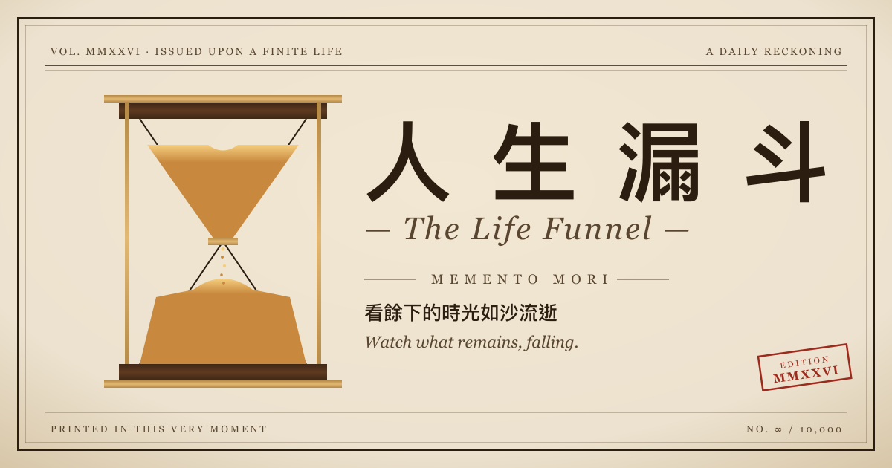

# 人生漏斗 · The Life Funnel

> 看餘下的時光如沙流逝。
> _Watch what remains, falling._

A vintage hourglass life-countdown — a quiet, daily reckoning of how much of your finite life remains, rendered as sand draining from an aged sand-glass.



---

## 這是什麼？ / What is this?

輸入你目前的歲數、性別、與目標壽命，頁面會在中央漏斗中讓沙緩緩自上流下，左右兩側計算剩餘的天數、小時、週末次數，並輪換中英雙語的反思箴言（Seneca、Marcus Aurelius、Annie Dillard …）。

Enter your current age, gender, and target lifespan. The hourglass at the center drains in real time; the side panels compute days, hours, and weekends remaining. Bilingual reflective quotes from Seneca, Marcus Aurelius, Annie Dillard, and others rotate every nine seconds.

不是恐怖的提醒，是一個 _Memento Mori_ — 「記住你終將一死」，因此認真活著。

Not a morbid reminder — a _Memento Mori_, a Stoic invitation to live deliberately because hours are finite and falling.

---

## 特色 / Features

- **復古沙漏視覺** — 木製框架、黃銅五金、紙質紋理背景；沙堆使用 SVG 顆粒紋理，落沙以 Canvas 動畫繪製，兩者共用同一座標系所以絕對對齊
- **雙語顯示** — 繁中為主、英文對照；襯線字（Noto Serif TC + Cormorant Garamond）
- **即時計算** — 剩餘天數 / 小時 / 週末次數、人生進度條，外加生活化的提醒（與父母見面次數、能讀的頁數、剩下的清晨）
- **4 種色彩主題** — Sepia 沙黃 / Parchment 羊皮 / Ledger 賬本綠 / Midnight 子夜
- **可調整沙粒** — 大小、密度、流速、開關箴言（右下角 ⚙ 按鈕）
- **10 句箴言輪播** — 每 9 秒一輪，全部中英對照

---

## 本地執行 / Run locally

純靜態頁面，沒有 build step。任一 HTTP server 都能跑：

```bash
# Python（macOS / Linux 內建）
python3 -m http.server 8000

# 然後在瀏覽器打開 http://localhost:8000
```

或：

```bash
# Node
npx serve .

# VS Code: 裝 Live Server 擴充，右鍵 index.html → Open with Live Server
```

> 直接雙擊 `index.html` 也能看到大部分內容，但 `<script type="text/babel">` 在 `file://` 協議下可能會被瀏覽器擋下來。用 HTTP server 是穩的。

---

## 部署 / Deploy

這是純靜態頁面（HTML / CSS / 透過 CDN 載入的 React + Babel），任何靜態主機都能放：

- **Cloudflare Pages** — 接 Git，push 後 30 秒自動上線；CDN 在台灣有節點，速度好
- **GitHub Pages** — repo Settings → Pages → 選 main branch
- **Netlify / Vercel** — 拖資料夾或接 Git
- **Netlify Drop** — 不用登入，拖一下就有網址，最快

### Build settings

全部留空：

| Setting | Value |
|---|---|
| Framework preset | None |
| Build command | _(empty)_ |
| Build output directory | _(empty / `/`)_ |

---

## 檔案結構 / Project structure

```
life-funnel/
├── index.html          # HTML shell, all CSS inline, meta tags, font loading
├── app.jsx             # Main React component (form, layout, state)
├── hourglass.jsx       # SVG silhouette + sand piles + canvas particles
├── quotes.jsx          # 10 bilingual quotes
├── tweaks-panel.jsx    # Floating tweaks controls (4 themes, sand sliders)
├── favicon.svg         # Browser tab icon
├── og-image.png        # 1200×630 social-share preview
├── og-image.svg        # Source for og-image.png (regenerate with sharp)
└── README.md
```

### How the hourglass aligns perfectly

The trick (worth knowing if you tweak `hourglass.jsx`): both **the static sand piles** and **the glass walls** live in the **same SVG `viewBox`** (`0 0 620 1000`). Only the falling grains are on the canvas overlay. This guarantees the piles can never drift sideways from the walls under any window size — an earlier version had them split between canvas and SVG, and the alignment broke. Keep them together.

### Regenerating the OG image

If you change the design and want a new social-share preview:

```bash
# install sharp once
npm i -g sharp-cli   # or use a local node script

# render og-image.svg → og-image.png at 1200×630
node -e "require('sharp')('og-image.svg').resize(1200, 630).png().toFile('og-image.png')"
```

---

## 致謝 / Credits

- Mocked up in [Claude Design](https://claude.ai/design); handed off to a coding agent for production.
- Quotes draw from Seneca, Marcus Aurelius, Annie Dillard, Benjamin Franklin, Henry David Thoreau, and Stoic tradition.
- Fonts: [Noto Serif TC](https://fonts.google.com/noto/specimen/Noto+Serif+TC), [Cormorant Garamond](https://fonts.google.com/specimen/Cormorant+Garamond), [IBM Plex Mono](https://fonts.google.com/specimen/IBM+Plex+Mono), [Special Elite](https://fonts.google.com/specimen/Special+Elite) — all via Google Fonts.

---

## 一句話 / In one line

> 你怎麼度過一天，就怎麼度過一生。
> _How we spend our days is how we spend our lives._ — Annie Dillard
